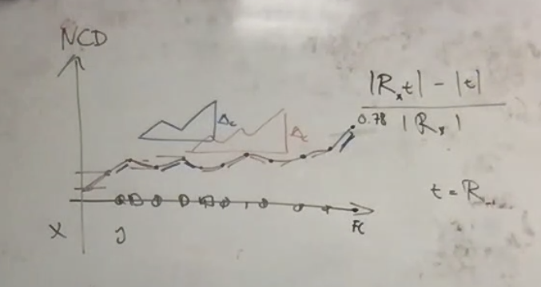

- [x] Handle directories recursively
- [x] Handle error when there is no .gitignore
  - [ ] Visualize the directory structure
- [ ] See what is most complex ts file in the Git Truck repository
- [ ] See what is most complex tsx file in the Git Truck repository
  - [ ] What is the most complex file in the repository?
  - [ ] Does that change over time?
- [ ] Watch mode for serve
- [ ] Add test

- [ ] Accumulated or max pair wise similarity between each file
- [ ] Normalization / Pre-processing

- Given a file, highlight the most similar files in the repository
- Clustering? (give me 10 clusters, which cluster does this file belong to?)

- The least similar file compared to the rest of the repository

- [ ] Meeting in January

Ideas
- Git Truck can run on Author tag, co-author tag
- but it would be cool if you could track and categorize commits that work on specific of the file pieces
- by tracking them using similarity

Goal: Give students a chance to figure out how much they have contributed to the project

Christian's course:
- Students hand in once a week
- At each deliverable, they get a two scores of how much they contributed to the project

- Productivity score (How much did they work since last week)
- Final solution similarity score (How much did their work contribute to the final solution)
  - Over each commit, run tool
  - How similar is that commit to the final commit

1st commit: very close to final solution
2nd commit

# Preprocessing:
Tresitter:
Use TreeSitter
- to put one token on each line (to avoid formatting to matter)
- to ignore comments (to avoid comments to matter, maybe an option to include comments?)
- to replace variables with a generic token (to minimize the impact of variable names), etc.

## Similarity to final solution

In the final solution, we want to know who contributed to this file
  - Go back in time and look at each commit (full state of the repo)
    - Check how similar it is to the final solution
    - Difference per commit
    - How much did this commit make repository similar to the final state of the repository
    - How much did this commit make repository similar to this file?

1. The compressed size of the repository at point $x$ |R_x f|
2.

Cumulative, Alice did so much towards the final solution and Bob did so much towards the final solution

